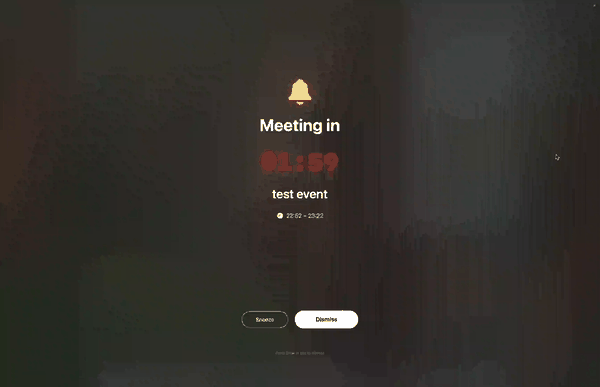
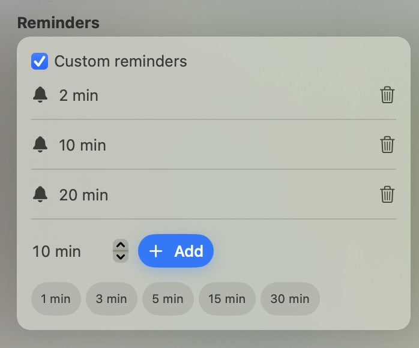
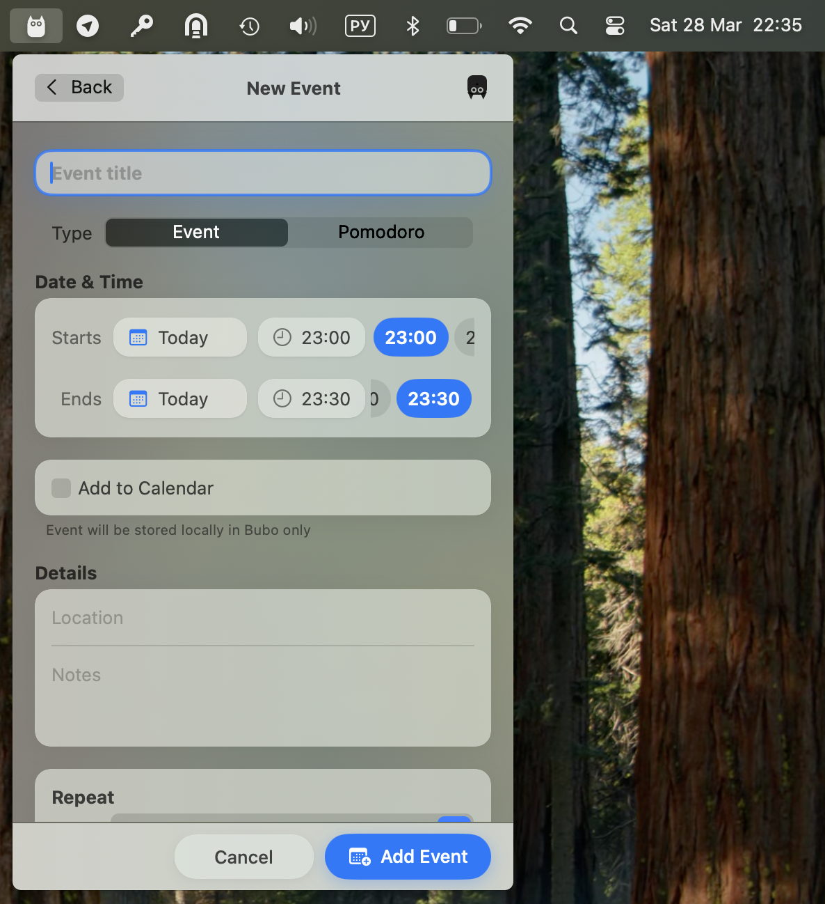
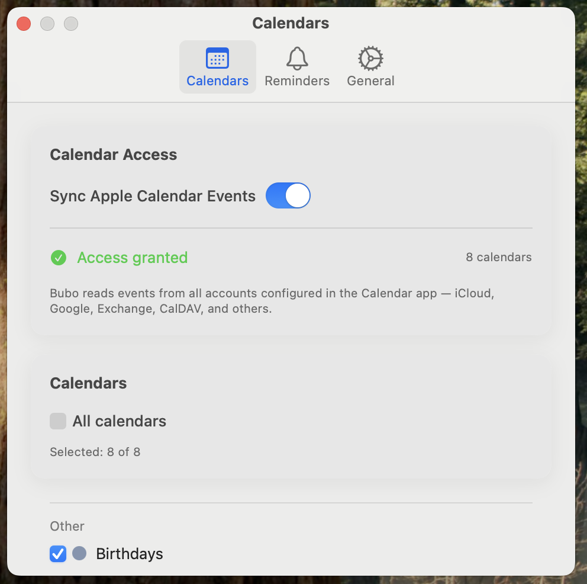

<p align="center">
  
</p>

<h1 align="center">Bubo</h1>

<p align="center">
  <strong>The calendar that lives in your menu bar and protects your focus.</strong><br>
  <sub>Native macOS app &middot; Requires macOS 13 Ventura or later</sub>
</p>

---

## The problem

You're deep in work. A meeting starts in 5 minutes. The tiny macOS notification pops up in the corner — you dismiss it without even reading. 15 minutes later you realize you missed the call.

Or this: you open Apple Calendar just to check what's next, and suddenly you're reorganizing your week instead of doing actual work. Context switch. Focus gone.

**Bubo fixes both.** It puts your schedule in the menu bar — one click, no app to launch, no window to manage. And when a meeting is approaching, it doesn't whisper — it **takes over the screen** so you can't accidentally ignore it.

<p align="center">
  
</p>

## How Bubo solves it

### Problem: "I keep missing meetings"

Most calendar apps send a small notification banner. You swipe it away out of habit. Bubo does something different: **the entire screen goes dark** with a countdown timer and meeting title. You physically cannot miss it.

<p align="center">
  
</p>

Stack multiple reminder intervals — 30 min, 10 min, 1 min — so you get progressively more urgent alerts. Each event can have its own set.

<p align="center">
  
</p>

### Problem: "Checking my calendar breaks my flow"

Opening a calendar app means switching contexts. Bubo lives in the menu bar — click the icon, see your whole day in a frosted-glass panel, click away. No app launch, no window management.

It sees every calendar your Mac already knows: **iCloud, Google, Exchange, Outlook, CalDAV**. Connect an account in System Settings once — Bubo picks it up automatically.

### Problem: "I need focus blocks but don't want coworkers to see them"

Sometimes you need to block time for deep work without broadcasting it. Bubo lets you create **local-only events** — private time blocks stored only on your Mac, invisible to anyone else.

<p align="center">
  
</p>

Create events in seconds: hit **+**, type a name, pick a time. Set up **recurring events** — daily, weekly on specific days, monthly ("second Tuesday"), yearly. Skip individual occurrences when plans change.

### Problem: "I can't stay focused for long stretches"

Toggle **Pomodoro mode** on any event and Bubo splits it into focused work sessions with timed breaks. A ring timer appears in the menu bar.

| Rhythm | Work | Break | Rounds |
|---|---|---|---|
| **Classic** | 25 min | 5 min | 4 |
| **Deep Work** | 50 min | 10 min | 2 |
| **Sprinter** | 15 min | 3 min | 4 |
| **52/17 Rule** | 52 min | 17 min | 3 |
| **Ultradian** | 90 min | 20 min | 1 |

When it's time to break, a full-screen overlay rises — not a notification you can swipe away, but a real signal to stop and rest.

Read the full [Pomodoro Guide &rarr;](docs/Pomodoro.md)

### Settings that stay out of the way

<p align="center">
  
</p>

- **Launch at login** — Bubo starts quietly with your Mac
- **Badge count** — see upcoming events on the menu bar icon
- **Calendar picker** — enable only the calendars you care about
- **Reminder intervals** — stack as many as you want, from 1 to 120 minutes
- **Full-screen alerts** or system notifications — your choice
- **Light, Dark, or System** appearance

---

## Install

**Download the DMG** from [Releases](https://github.com/avpv/bubo/releases/latest), drag to Applications, and run:
```bash
xattr -cr /Applications/Bubo.app
```

**Or install from the command line:**
```bash
curl -fsSL https://raw.githubusercontent.com/avpv/bubo/HEAD/scripts/install.sh | bash
```

**Or build from source:**
```bash
git clone https://github.com/avpv/bubo.git && cd bubo
open -a Xcode Package.swift   # Cmd+R to run
```

## Connect your calendars

1. **System Settings &rarr; Internet Accounts** — add your Google, Outlook, or Exchange account and enable Calendars.
2. Launch Bubo &rarr; **Settings &rarr; Calendars** &rarr; enable **Sync Apple Calendar Events**.
3. Grant the privacy permission when prompted.

Every calendar your Mac can see, Bubo can see.

---

<p align="center">
  <em>Bubo doesn't want your attention. It wants to protect it.</em>
</p>
