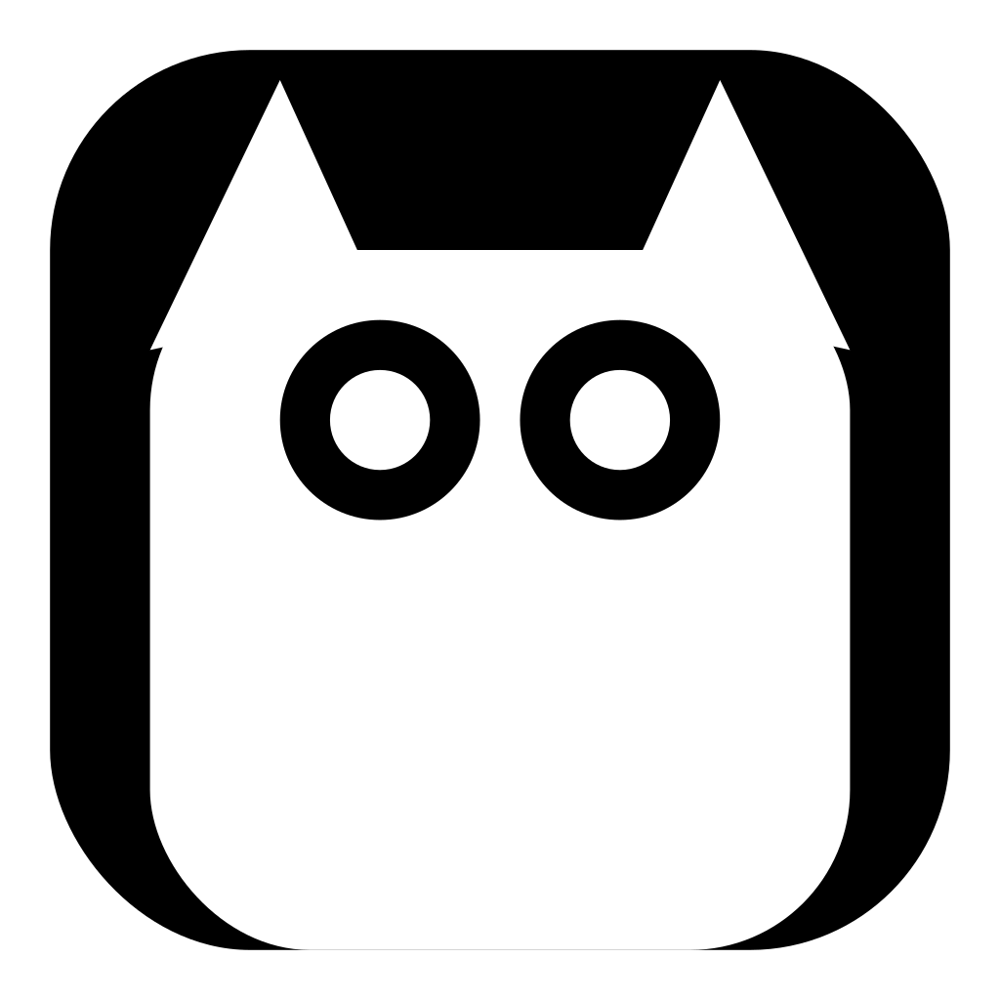
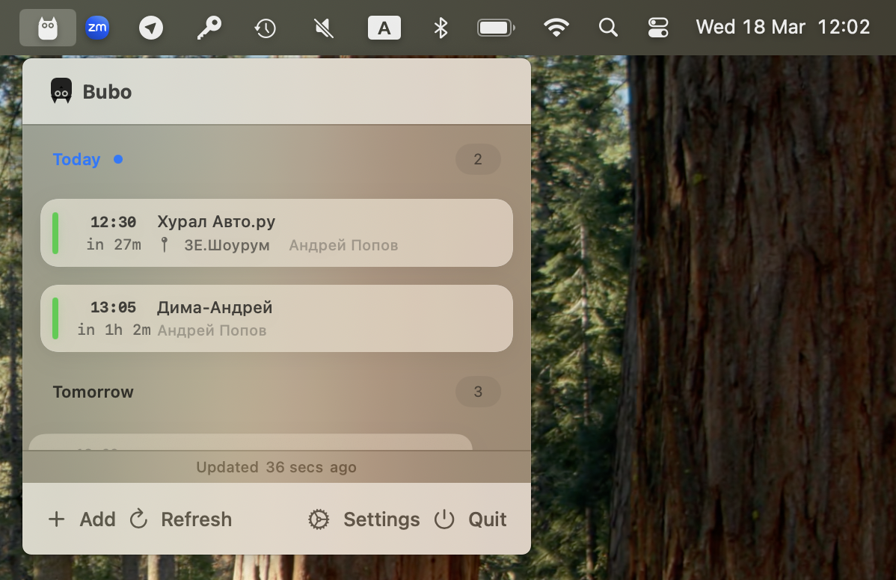
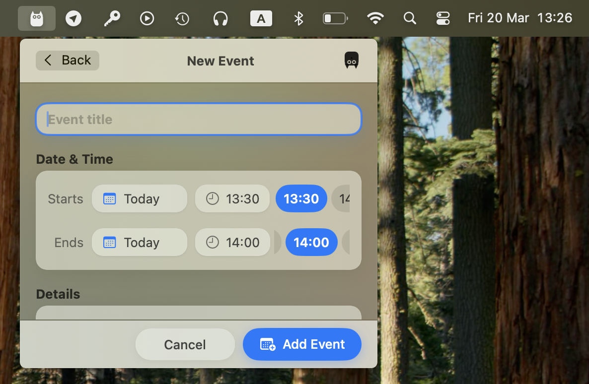
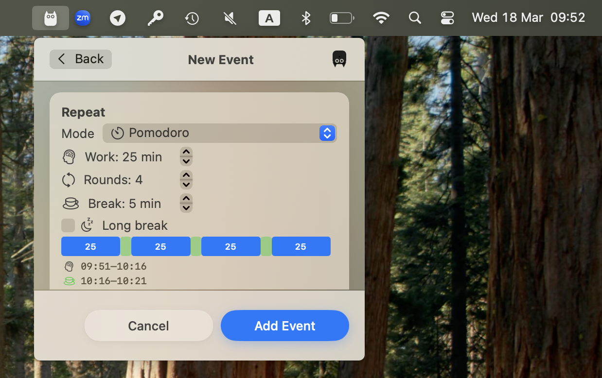

<p align="center">
  
</p>

<h1 align="center">Bubo</h1>

<p align="center">
  <strong>Native macOS Menu Bar Calendar, Pomodoro, and Focus App</strong>
</p>


Bubo is native macOS menu bar application dedicated to preserving your focus. Built with modern, glassmorphic **macOS 2026 aesthetics**, it serves as a lightweight calendar client, meeting reminder system, and advanced Pomodoro cycle tracker. 

## How it Works

### 1. Daily Planner & Timeline


Bubo lives entirely in your macOS menu bar. Click the calendar icon to reveal your daily timeline. 
- **View Your Day:** See a beautiful, frosted-glass list of your upcoming meetings and tasks. 
- **Calendar Sync:** Bubo automatically pulls data from iCloud, Google, Exchange, Outlook, and CalDAV without any extra logins. 

<br clear="both"/>

### 2. Creating an Event


Adding tasks or meetings is blazing fast and doesn't require opening a heavy standalone app.
- Click the **"+" (Add Event)** button in the header.
- Fill out the minimalist form with your **Task Name**, **Date**, **Time**, and **Duration**.
- You can create events that sync to your external calendars, or keep them completely local by toggling off Apple Calendar sync in Settings (Standalone Mode).

<br clear="both"/>

### 3. Pomodoro Focus Timer


Say goodbye to context-switching. Block your schedule and start focus sessions directly from the menu bar.
- When creating an event, look for the **Pomodoro** toggle under recurrence settings.
- Select your preferred work interval (e.g., 25 minutes) and how many rounds you want to do.
- Bubo will lock you into a focus session, showing a prominent ring timer and providing full-screen alerts when it is time to take a break.
- Read our full [Pomodoro Technique & Workflow Guide](docs/Pomodoro.md) to explore the best interval combinations (Classic, Deep Work, Sprinter).

<br clear="both"/>

## Key Features
- **Customizable reminder intervals** — add any number of reminders (1, 5, 10, 30 min, etc.)
- **Full-screen, distraction-blocking notifications** with live countdowns — never miss a meeting again.
- **Snooze** directly from the UI.
- **Do Not Disturb** quiet hours system.

### 🎨 Native Design
Bubo uses custom AppKit + SwiftUI logic to provide a visually stunning experience. Frosted glass platters, fluid bounce animations, dynamic haptic feedback, and cohesive typography seamlessly blend into the premium macOS desktop environment.

## Requirements

- macOS 13.0 (Ventura) or later

## Installation

### Option A: One-Command Install (Easiest)
```bash
curl -fsSL https://raw.githubusercontent.com/avpv/bubo/main/scripts/install.sh | bash
```

### Option B: Download Release
1. Go to [Releases](https://github.com/avpv/bubo/releases/latest)
2. Download **Bubo.dmg**
3. Open the downloaded image and drag **Bubo** to your **Applications** folder.
4. *Gatekeeper Bypass:* Run `xattr -cr /Applications/Bubo.app` in your terminal, then launch the app normally.

### Option C: Build from Source
1. Clone the repository: `git clone https://github.com/avpv/bubo.git`
2. Open the directory: `cd Bubo`
3. Launch Xcode: `open -a Xcode Package.swift`
4. Press **Cmd+R** to build and run the application.

## Calendar Setup

Bubo relies on macOS EventKit. To synchronize external calendars:
1. Open your Mac's **System Settings → Internet Accounts**.
2. Add your accounts (Google, Outlook, etc.) and enable the **Calendars** toggle.
3. Launch Bubo, click the specific **Settings gear icon**, and navigate to **Calendars**.
4. Enable **"Sync Apple Calendar Events"** and grant the required privacy permissions.

---
*Bubo follows the MVVM architecture and is built entirely in Swift and SwiftUI.*
