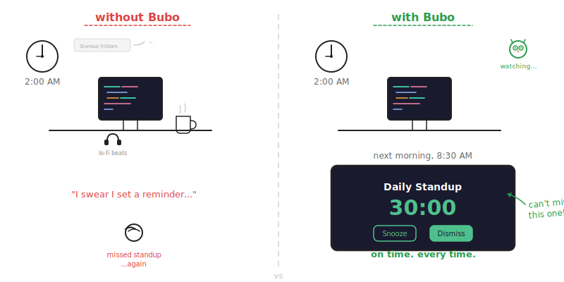

<p align="center">
  
</p>

<h1 align="center">Bubo</h1>

<p align="center">
  <strong>The calendar that lives in your menu bar and protects your focus.</strong><br>
  <sub>Native macOS app &middot; Requires macOS 13 Ventura or later</sub>
</p>

---

Bubo is a menu bar calendar for macOS that combines your schedule, focus timer, and meeting reminders in one place — without ever opening a separate window.

<p align="center">
  
</p>

## Your day at a glance

Click the icon in your menu bar. A frosted-glass panel drops down showing your full day: every meeting, every task, how long until the next one starts, and who's attending. No app to launch. No context switch.

Bubo sees every calendar your Mac already knows about — **iCloud, Google, Exchange, Outlook, CalDAV**. Connect an account once in System Settings, and it appears in Bubo automatically. No extra logins.

## Create events in seconds


Hit **+**, type a name, pick a time. Done. Events sync back to Apple Calendar, or you can keep them **local-only** — completely private blocks of time invisible to the outside world.

Set up **recurring events** with full flexibility: daily, weekly on specific days, monthly by date or weekday ("second Tuesday"), yearly. Skip individual occurrences whenever plans change.

<br clear="both"/>

## Built-in Pomodoro timer


Toggle Pomodoro mode on any event, and Bubo splits it into focused work sessions with timed breaks. A ring timer appears in the menu bar. Your calendar blocks out. The world goes quiet.

Choose the rhythm that matches your work:

| Rhythm | Work | Break | Rounds |
|---|---|---|---|
| **Classic** | 25 min | 5 min | 4 |
| **Deep Work** | 50 min | 10 min | 2 |
| **Sprinter** | 15 min | 3 min | 4 |
| **52/17 Rule** | 52 min | 17 min | 3 |
| **Ultradian** | 90 min | 20 min | 1 |

When it's time to break, a full-screen overlay rises — not a notification you can swipe away, but a real signal to stop and rest. When the break ends, Bubo brings you back.

Read the full [Pomodoro Guide &rarr;](docs/Pomodoro.md)

<br clear="both"/>

## Reminders you won't miss

<p align="center">
  
</p>

Most apps remind you with a banner in the corner. You dismiss it without reading. Bubo takes a different approach: when a meeting is approaching, the **entire screen goes dark** with a countdown timer, the meeting title, and the time left. You cannot accidentally ignore it.

**Stack multiple intervals** — get a nudge at 30 minutes, again at 10, and a final alert at 1 minute. Each event can have its own custom set.

**Snooze** when you're not ready. Bubo steps back and returns later.

<p align="center">
  
</p>

## Settings that stay out of the way

- **Launch at login** — Bubo starts quietly with your Mac
- **Badge count** — see upcoming events on the menu bar icon (whole day or a custom time window)
- **Calendar picker** — enable only the calendars you care about
- **Reminder intervals** — add as many as you want from 1 to 120 minutes
- **Full-screen alerts** or system notifications — your choice
- **Light, Dark, or System** appearance

---

## Install

**Download the DMG** from [Releases](https://github.com/avpv/bubo/releases/latest), drag to Applications, and run:
```bash
xattr -cr /Applications/Bubo.app
```

**Or install from the command line:**
```bash
curl -fsSL https://raw.githubusercontent.com/avpv/bubo/HEAD/scripts/install.sh | bash
```

**Or build from source:**
```bash
git clone https://github.com/avpv/bubo.git && cd bubo
open -a Xcode Package.swift   # Cmd+R to run
```

## Connect your calendars

1. **System Settings &rarr; Internet Accounts** — add your Google, Outlook, or Exchange account and enable Calendars.
2. Launch Bubo &rarr; **Settings &rarr; Calendars** &rarr; enable **Sync Apple Calendar Events**.
3. Grant the privacy permission when prompted.

Every calendar your Mac can see, Bubo can see.

---

<p align="center">
  <em>Bubo doesn't want your attention. It wants to protect it.</em>
</p>
