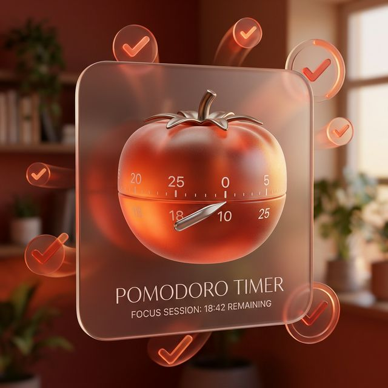

<h1 align="center">Owlenda</h1>

<p align="center">
  <strong>Native macOS Menu Bar Calendar, Pomodoro, and Focus App</strong>
</p>

<p align="center">
  
</p>

Owlenda is a beautifully designed, native macOS menu bar application dedicated to preserving your focus. Built with modern, glassmorphic **macOS 2026 aesthetics**, it serves as a lightweight calendar client, meeting reminder system, and advanced Pomodoro cycle tracker. 

## Features

### 📅 Universal Calendar Sync


Owlenda syncs flawlessly with **all calendars** configured in macOS native settings — iCloud, Google, Exchange, Outlook, CalDAV. No extra setup or sketchy OAuth logins required. If it shows up in your Mac's Calendar.app, it shows up in Owlenda.

<br clear="both"/>

### 🍅 Built-In Pomodoro Engine


Say goodbye to context-switching. Block your schedule and start focus sessions directly from the menu bar. Owlenda supports advanced, fully customizable Pomodoro time-boxing logic.
- **Classic, Deep Work, Sprinter, and Ultradian** rhythms.
- Read our full [Pomodoro Technique & Workflow Guide](docs/Pomodoro.md) to supercharge your productivity.

<br clear="both"/>

### 🔌 Standalone Local Mode


Prefer to keep things local? Toggle off Apple Calendar Sync in Settings to enter **Standalone Mode**. Owlenda will instantly become an offline-first, local event and Pomodoro tracker without ever pinging external accounts.

<br clear="both"/>

### 🔔 Full-Screen Reminders
- **Customizable reminder intervals** — add any number of reminders (1, 5, 10, 30 min, etc.)
- **Full-screen, distraction-blocking notifications** with live countdowns — never miss a meeting again.
- **Snooze** directly from the UI.
- **Do Not Disturb** quiet hours system.

### 🎨 Native Design
Owlenda uses custom AppKit + SwiftUI logic to provide a visually stunning experience. Frosted glass platters, fluid bounce animations, dynamic haptic feedback, and cohesive typography seamlessly blend into the premium macOS desktop environment.

## Requirements

- macOS 13.0 (Ventura) or later

## Installation

### Option A: One-Command Install (Easiest)
```bash
curl -fsSL https://raw.githubusercontent.com/avpv/owlenda/main/scripts/install.sh | bash
```

### Option B: Download Release
1. Go to [Releases](https://github.com/avpv/owlenda/releases/latest)
2. Download **Owlenda.dmg**
3. Open the downloaded image and drag **Owlenda** to your **Applications** folder.
4. *Gatekeeper Bypass:* Run `xattr -cr /Applications/Owlenda.app` in your terminal, then launch the app normally.

### Option C: Build from Source
1. Clone the repository: `git clone https://github.com/avpv/owlenda.git`
2. Open the directory: `cd Owlenda`
3. Launch Xcode: `open -a Xcode Package.swift`
4. Press **Cmd+R** to build and run the application.

## Calendar Setup

Owlenda relies on macOS EventKit. To synchronize external calendars:
1. Open your Mac's **System Settings → Internet Accounts**.
2. Add your accounts (Google, Outlook, etc.) and enable the **Calendars** toggle.
3. Launch Owlenda, click the specific **Settings gear icon**, and navigate to **Calendars**.
4. Enable **"Sync Apple Calendar Events"** and grant the required privacy permissions.

---
*Owlenda follows the MVVM architecture and is built entirely in Swift and SwiftUI.*
