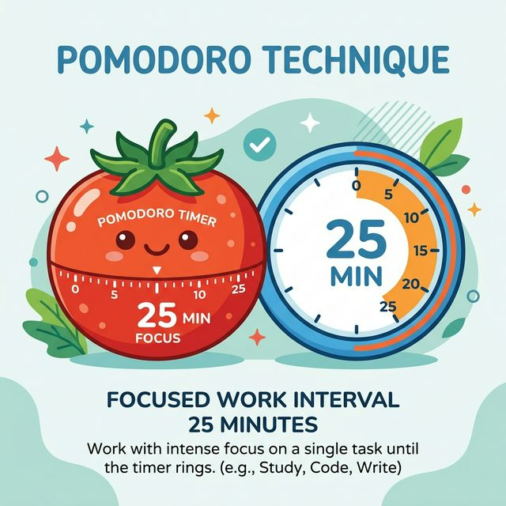
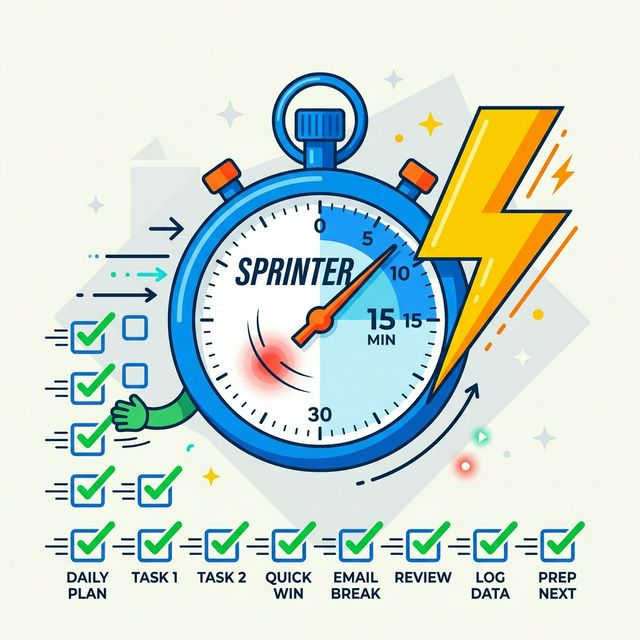

# The Pomodoro Technique with Owlenda 🦉🍅

The Pomodoro Technique is a time management method developed by Francesco Cirillo. It uses a timer to break work into intervals, traditionally 25 minutes long, separated by short breaks. By chunking your workflow, you maintain high mental agility and prevent burnout.

With Owlenda, you can natively block your calendar and reserve your time for deep work through automated Pomodoro event generation.

---

## How it Works

1. **Pick a task** you want to focus on natively through the Owlenda menu bar.
2. **Set the Work duration** (e.g., 25 minutes).
3. **Commit** and work entirely focused until the event ends.
4. **Take a Short Break** (typically 5 minutes) to stretch or grab water.
5. **After several Rounds**, take a longer, restorative break (15-30 minutes).

---

## Recommended Setting Combinations

Feel free to tweak Owlenda's Recurrence parameters to fit your personal workflow. Here are the most effective combinations used by professionals:

### 1. The Classic (Standard Focus)
The traditional setup developed by Cirillo, perfect for mixed cognitive tasks.

- **Work:** 25 min
- **Rounds:** 4
- **Break:** 5 min
- **Long Break:** 15 min (enabled, after 4 rounds)

### 2. Deep Work (For Coding, Writing, Design)
Longer focus periods for complex tasks that require loading a lot of context into your brain. Constant 5-minute interruptions can break your "flow state" here.

- **Work:** 50-60 min
- **Rounds:** 2
- **Break:** 10 min
- **Long Break:** 20-30 min

### 3. The Sprinter (Administrative Tasks / Emails)
Short, rapid bursts. Best used when you have low energy or a large backlog of dozens of tiny, unrelated tasks (like clearing out an inbox).

- **Work:** 15 min
- **Rounds:** 4
- **Break:** 3-5 min
- **Long Break:** 15 min

### 4. The Ultradian Rhythm (Advanced)
Based on human natural energy cycles. Humans biologically cycle through 90-minute peaks of alertness.
- **Work:** 90 min
- **Rounds:** 1
- *(Take a natural unplugged 20-30 minute break before scheduling your next event).*

Happy focusing! 🦉
